# Azure API Management Workshop @ APIStrat 2016

Thanks for attending Azure API Management (__APIM__) workshop at APIStrat 2016. In this workshop, we will start with giving you a brief overview of APIM. Then we will demonstrate the key features and capabilities of the product – policies and expressions, built-in and custom analytics, configuration over Git, portal customization and more.

If you have any questions during the workshop, please let us know at any time! 

# Prerequisite
To follow along you need to provision your own instance of APIM and have it ready by the start of the session. See https://aka.ms/createapim for directions. 

# Steps
## Launch the Publisher Portal
Once your API Management instance is created, find it in the Azure portal and click on it. You will see the dashboard of your API Management instance. Click on "Manage". This brings you to the publisher portal. 

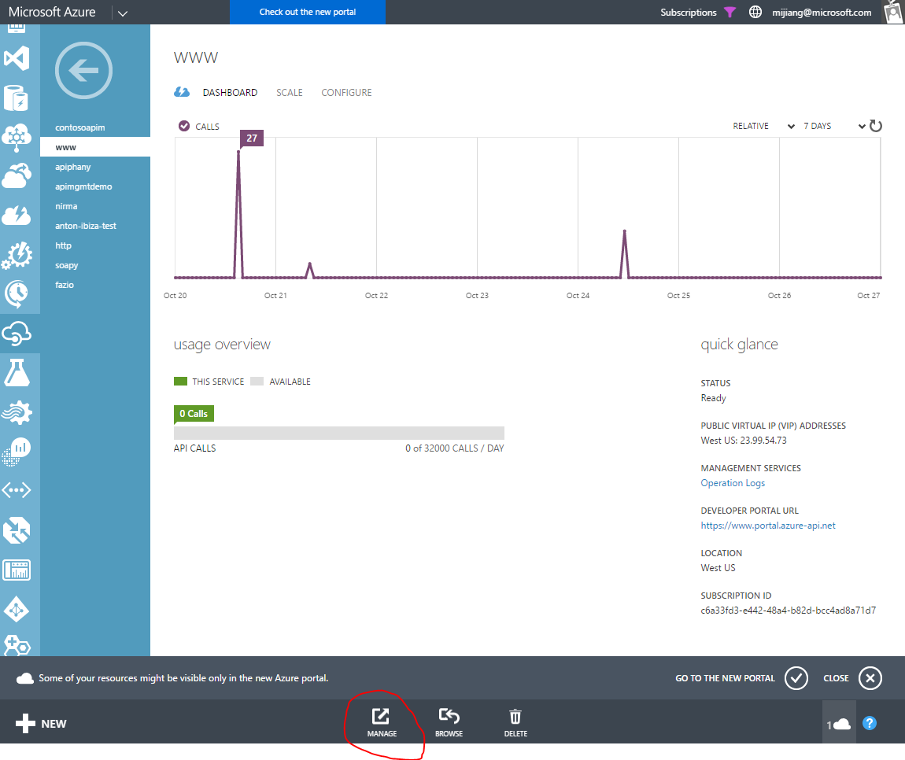

## Import an API using Swagger
We are going to import a RESTful API we created for this workshop. Here is the link to it's swagger file.

```
http://apim-conf.azurewebsites.net/swagger/docs/v1
```

To import this API, click "Import API". In the popup screen, choose "From URL" then paste the above URL and choose Swagger. Also, please fill in the other fields as below then click save. 

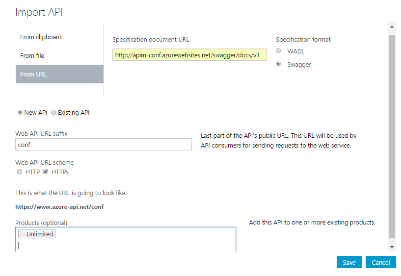

## Call the API from the Console
Click "Developer portal".


Navigate to APIs and click on "ConferenceApiApp".

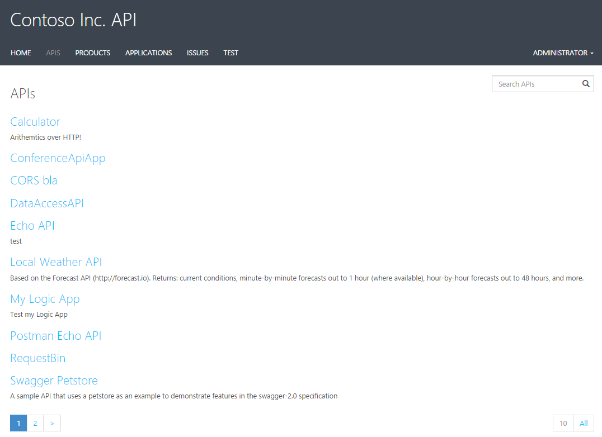

Go to "Home_Get" operation and click "Try it".

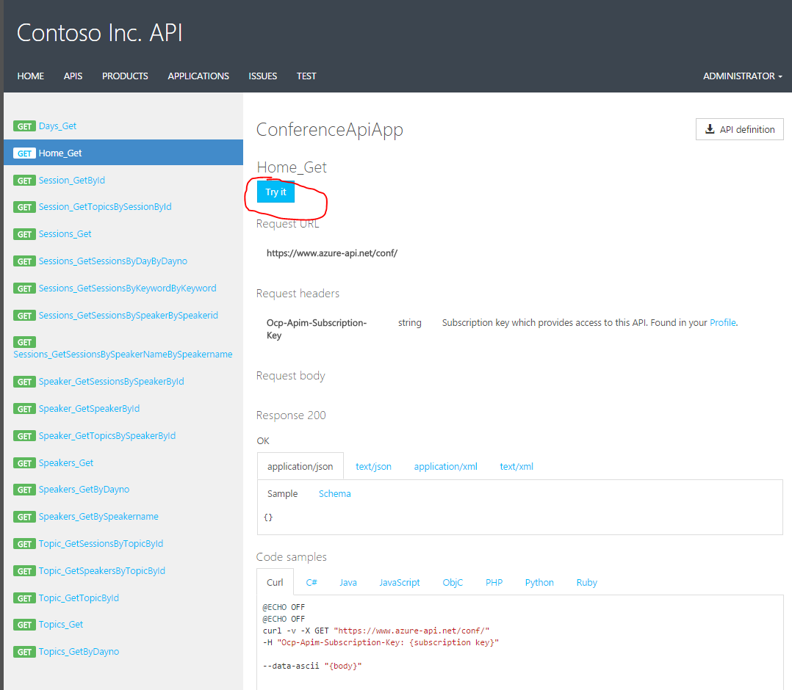

Click Send and check out the responses.

## Basic Policies
Switch back to the publisher portal, click "Policies" and set the scope to be "ConferenceApiApp", and click "ADD POLICY".

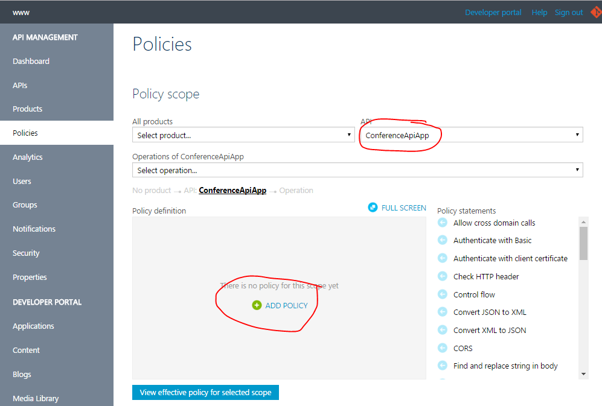

### Remove Headers
```
        <set-header name="X-Powered-By" exists-action="delete" />
		<set-header name="X-AspNet-Version" exists-action="delete" />
		<set-header name="Pragma" exists-action="delete" />
```

### Find and Replace
```
        <find-and-replace from="://apim-conf.azurewebsites.net" to="://www.azure-api.net" />
```

### Rate Limit
```
        <rate-limit-by-key calls="3" renewal-period="10" counter-key="@(context.Request.IpAddress)" />
```

### Cache
```
    <policies>
        <inbound>
            <base />
            <cache-lookup vary-by-developer="false" vary-by-developer-groups="false">
                <vary-by-header>Accept</vary-by-header>
                <vary-by-header>Accept-Charset</vary-by-header>
            </cache-lookup>
        </inbound>
        <backend>
            <base />
        </backend>
        <outbound>
            <base />
            <cache-store duration="3600" />
        </outbound>
    </policies>
```

## Basic Analytics
To view API analytics, navigate to "Analytics" in the publisher portal. Feel free to play around with it. 

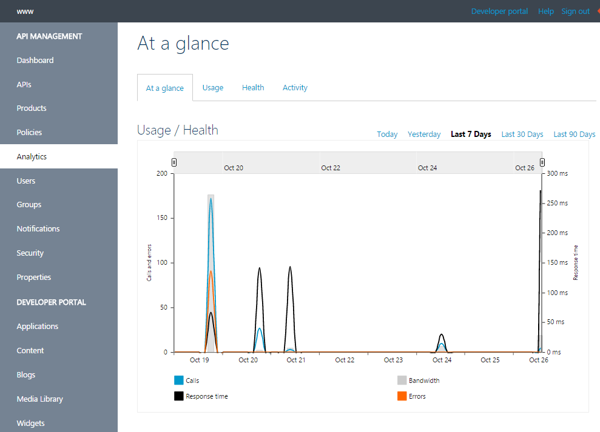

## GIT Integration
Navigate to "Security" in the publisher portal and then go to "Configuration repository".

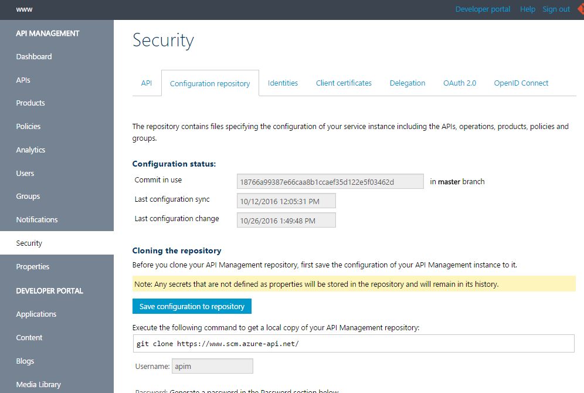

Click "Save configuration to repository" and "Ok". This will take 10-30 seconds depending on the pricing tier of your APIM instance.

Execute the following command to get a local copy of your API Management repository:

```
    git clone https://{instance name}.scm.azure-api.net/
```

On your laptop, go to the folder that contains the local copy, navigate to api-management/apis/ConferenceApiApp 

Open configuration.json and change the name of the API and commit your changes to the local copy using below commands

```
    git add --all 
    git commit -m "description of your changes"
```

Then execute the following command to push the changes back to your APIM repo:

```
    git pull
```

Go back to the publisher portal, click "Deploy repository configuration. 

## Advanced Policies
```
    <on-error>
		<send-request mode="new" response-variable-name="commicResponse" timeout="60" ignore-error="true">
			<set-url>https://imgs.xkcd.com/comics/30_days_hath_september.PNG</set-url>
			<set-method>GET</set-method>
		</send-request>
		<return-response response-variable-name="commicResponse">
			<set-status code="200" reason="Something happened, but we want you to be happy" />
		</return-response>
	</on-error>
```

## Integrate with Azure Logic Apps
### Build a Logic App
Go to Azure Portal: https://portal.azure.com and click "New".

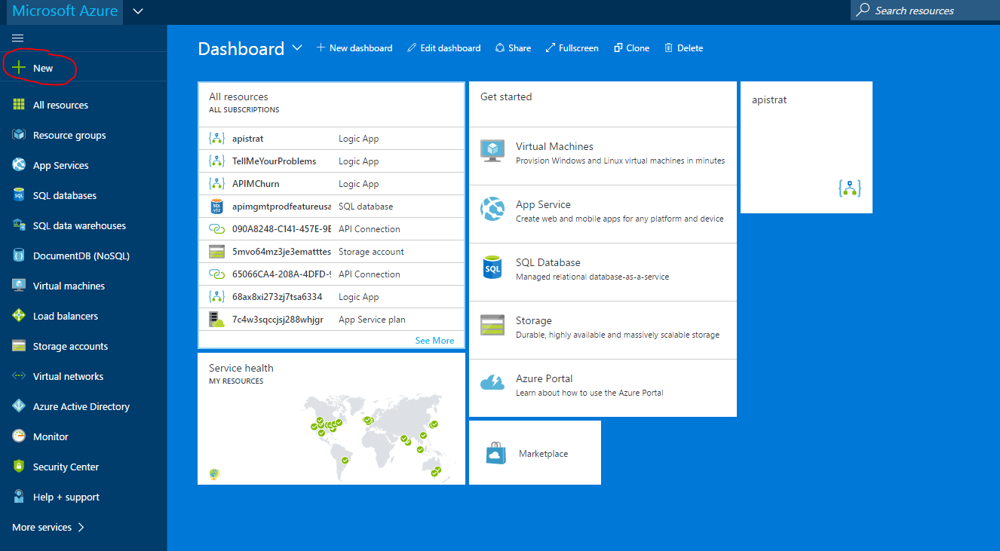

Search for "Logic Apps" and click "Create".


Provide the name, subscription, resource group and choose a location for this new Logic App. 

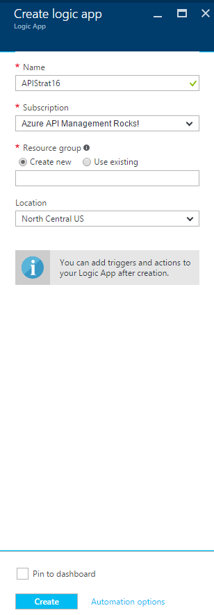

Once the Logic App is created, go to the Logic App Designer, choose the "HTTP Request-Response" template.


Provide the body text in the "Response" card.

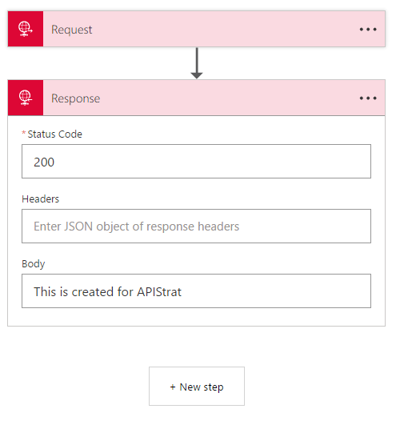

### Import Logic App into APIM  
To import an Logic App into APIM, you will need to use the new publisher UI in the Azure portal, which is currently in preview. 

Use below link to access the preview:

```
    http://aka.ms/pbizaflag
```

Click on All resources.

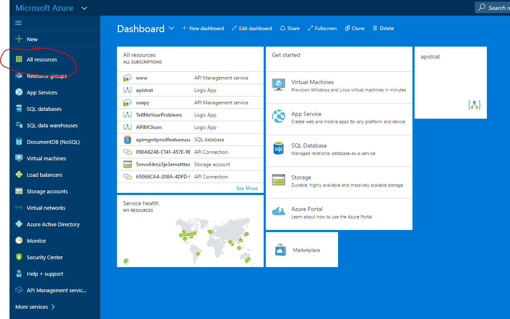

Search for your APIM instance and click on the search result. 


Navigate to APIs.

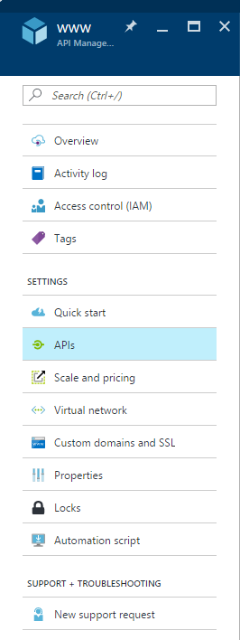

Click Add API and choose from "Logic App".


Click Browse and select your Logic App.

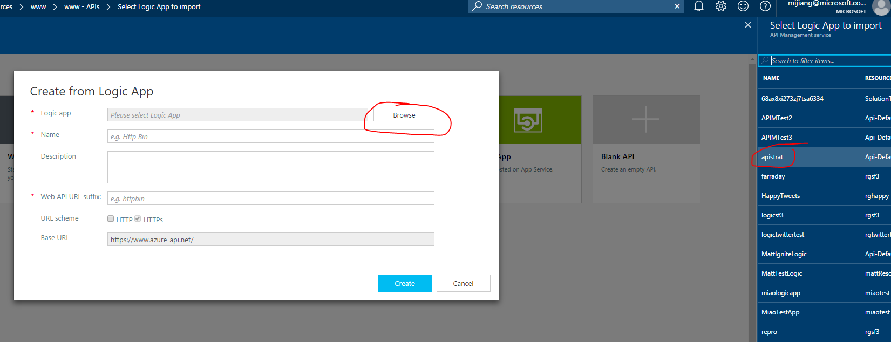

Provide details for this API.

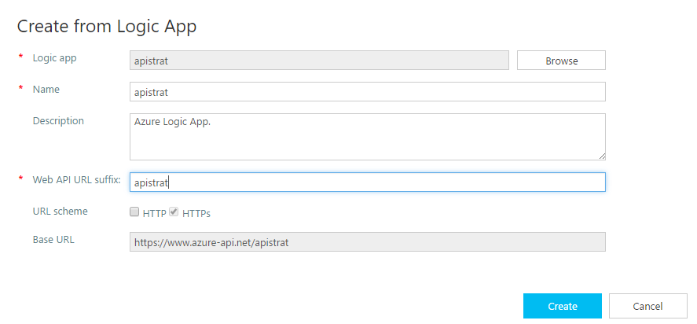

Once the Logic App is imported, feel free to play with it. 

## Portal Customization

From the publisher portal, click 'developer portal'.


Click the icon on the left. 

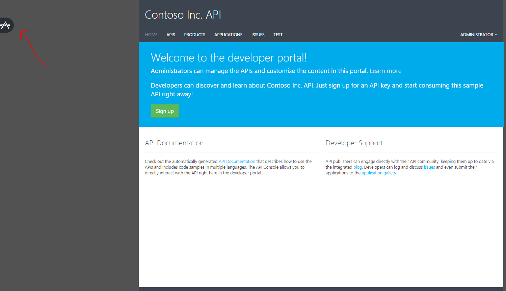

Click "Templates" and then choose "Opeation"


## Import a SOAP API
Let's try to import a SOAP API using the below WSDL file. The steps are the same as importing a REST API.

```
    http://www.webservicex.com/CurrencyConvertor.asmx?Wsdl
```